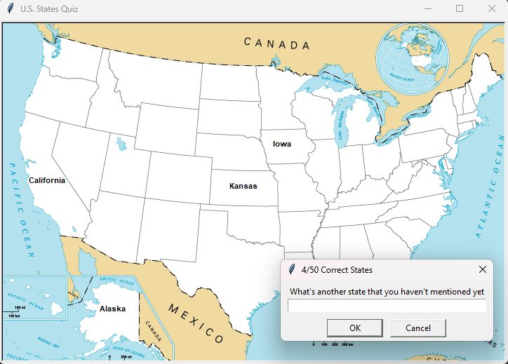

  <h1>U.S. States Game using Turtle Graphics Library</h1>

  
This is a simple implementation of the U.S. States Game in Python using the Turtle graphics library and the Pandas package. The game is built with Python 3 and utilizes the Turtle module for graphical representation and the Pandas package for CSV data manipulation.

   <h2>Features</h2>

  <ul>
        <li>U.S. States Game experience.</li>
        <li>Simple and clean code.</li>
        <li>Uses Turtle graphics for a visual representation.</li>
        <li>Uses the Pandas package for CSV data manipulation</li>
        <li>Enter state names, and the Turtle will move to the location of the entered state on the U.S. map.</li>
    </ul>

  <h2>Requirements</h2>

  <ul>
        <li>Python 3.x</li>
        <li>Turtle graphics library (comes with Python standard library)</li>
        <li>Pandas package</li>
    </ul>

  <h2>How to Play</h2>
    <ol>
        <li>Clone the repository to your local machine:</li>
        <pre><code>git clone https://github.com/Elhaoua-Alaaeddine/US_States_Game.git</code></pre>
        <li>Change to the project directory:</li>
        <pre><code>cd US_States_Game</code></pre>
        <li>Run the game:</li>
        <pre><code>python main.py</code></pre>

   <li>Enter the names of U.S. states, and every correct answer will go to the location of the entered state on the map.</li>
    </ol>

  <h2>Screenshots</h2>
    
    <h2>License</h2>
    
This U.S. States Game is open-source and available under the <a href="LICENSE">MIT License</a>.

    <h2>Acknowledgments</h2>
    <ul>
        <li>Inspired by the U.S. States Game concept.</li>
        <li>Turtle graphics library for Python.</li>
        <li>Pandas package for Python.</li>
    </ul>
    
Have fun playing the U.S. States Game! 🗺️

